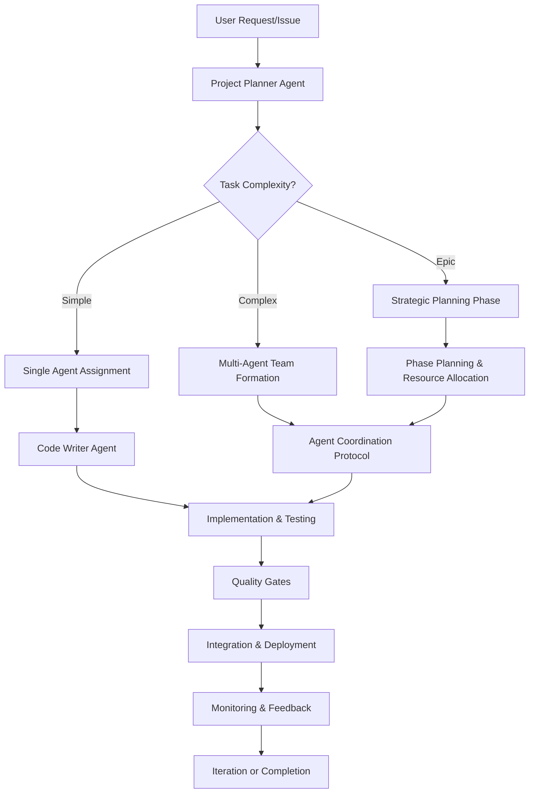
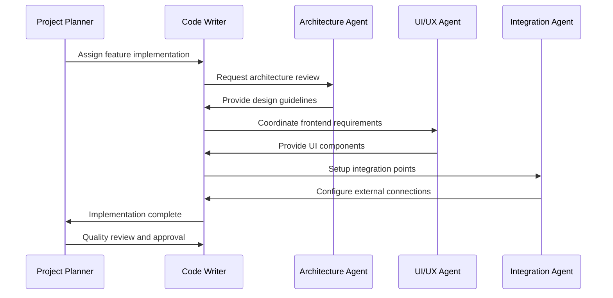

# Development Workflows - Second Brain Project

## Overview

This document defines comprehensive development workflows optimized for AI agent coordination and human-AI collaboration in the Second Brain project. It builds upon the existing AGENTS.md guide and incorporates strategic planning from the Phase 2 roadmap.

**Document Purpose**: Standardize development processes for optimal agent coordination and project efficiency  
**Target Audience**: AI agents, development team, project coordinators  
**Integration**: Complements AGENTS.md and PHASE_2_ROADMAP.md  

---

## 1. Workflow Architecture

### 1.1 Multi-Agent Development Model



### 1.2 Workflow Types by Complexity

| Workflow Type | Duration | Agents Involved | Coordination Level |
|---------------|----------|-----------------|-------------------|
| **Bug Fix** | 1-4 hours | 1 (Code Writer) | None |
| **Feature Enhancement** | 4-16 hours | 1-2 agents | Light |
| **New Feature** | 1-5 days | 2-4 agents | Standard |
| **System Integration** | 1-2 weeks | 4+ agents | High |
| **Architecture Change** | 2+ weeks | All relevant agents | Strategic |

---

## 2. Project Planning Workflows

### 2.1 Strategic Feature Planning Workflow

#### Phase 1: Requirements Analysis (Project Planner)
```yaml
Duration: 1-2 hours
Inputs:
  - User requirements or strategic objectives
  - Current system state analysis
  - Resource availability assessment
  - Technical constraints and dependencies

Process:
  1. Analyze requirements against PRD roadmap
  2. Assess technical feasibility and complexity
  3. Identify required agent specializations
  4. Estimate timeline and resource needs
  5. Create strategic implementation plan

Outputs:
  - Detailed task breakdown structure
  - Agent assignment recommendations
  - Timeline with milestones
  - Risk assessment and mitigation plan
  - Success criteria definition
```

#### Phase 2: Team Formation & Coordination Setup
```yaml
Duration: 30 minutes
Participants: Project Planner + Assigned Agents

Process:
  1. Brief team on project scope and objectives
  2. Assign primary and supporting agent roles
  3. Define handoff points and dependencies
  4. Establish communication protocols
  5. Set up progress monitoring and reporting

Outputs:
  - Agent responsibility matrix
  - Communication schedule
  - Progress tracking setup
  - Quality gate definitions
```

### 2.2 Rapid Response Workflow (Bug Fixes/Hotfixes)

#### Emergency Response Protocol
```yaml
Trigger: Critical bugs, security issues, system outages
Duration: Immediate to 4 hours
Lead Agent: Code Writer (with specialization as needed)

Process:
  1. Immediate triage and severity assessment
  2. Assign appropriate specialist agent
  3. Implement fix with minimal disruption
  4. Deploy through expedited testing pipeline
  5. Monitor system stability post-deployment

Quality Gates:
  - Security review for critical fixes
  - Minimal viable testing suite
  - Rollback procedure validated
  - Post-deployment monitoring active
```

---

## 3. Implementation Workflows

### 3.1 Feature Development Workflow

#### Standard Feature Implementation Process


#### Implementation Stages

**Stage 1: Design & Architecture (Duration: 10-20% of total time)**
- Architecture Agent designs system changes
- Database schema updates planned
- API endpoints and integration points defined
- Performance impact assessment
- Security considerations documented

**Stage 2: Core Implementation (Duration: 60-70% of total time)**  
- Code Writer implements backend functionality
- UI/UX Agent creates frontend components
- Integration Agent handles external connections
- Unit tests written alongside implementation
- Documentation updated incrementally

**Stage 3: Integration & Testing (Duration: 15-20% of total time)**
- Integration testing across all components
- End-to-end testing for user workflows
- Performance testing and optimization
- Security validation and compliance checks
- User acceptance testing preparation

**Stage 4: Deployment & Monitoring (Duration: 5-10% of total time)**
- Staged deployment with feature flags
- Real-time monitoring and alerting setup
- User feedback collection and analysis
- Performance monitoring and optimization
- Documentation finalization and publication

### 3.2 Code Review & Quality Assurance Workflow

#### Multi-Agent Code Review Process
```yaml
Primary Review (Code Writer):
  - Code structure and logic correctness
  - Test coverage and quality
  - Documentation completeness
  - Coding standards compliance

Specialized Reviews:
  Architecture Agent:
    - System design consistency
    - Performance implications
    - Scalability considerations
    - Technical debt assessment
    
  Security Audit Agent:
    - Security vulnerability assessment
    - Authentication and authorization
    - Data protection compliance
    - Input validation and sanitization
    
  UI/UX Agent:
    - User interface consistency
    - Accessibility compliance
    - Mobile responsiveness
    - User experience quality
```

#### Quality Gates Checklist
```markdown
# Quality Gates Checklist

## Code Quality
- [ ] Linting passes (PEP8, ESLint)
- [ ] Type checking passes (mypy, TypeScript)
- [ ] Unit test coverage >90%
- [ ] Integration tests pass
- [ ] No critical security vulnerabilities

## Documentation
- [ ] API endpoints documented
- [ ] Code comments for complex logic
- [ ] README updated if needed
- [ ] Migration scripts documented

## Performance
- [ ] Performance benchmarks meet targets
- [ ] No memory leaks detected
- [ ] Database queries optimized
- [ ] Frontend bundle size acceptable

## Security
- [ ] Security review completed
- [ ] Authentication/authorization tested
- [ ] Input validation implemented
- [ ] Data encryption verified
```

---

## 4. Agent-Specific Workflows

### 4.1 Code Writer Agent Workflow

#### Daily Development Cycle
```yaml
Morning (9:00 AM):
  1. Review assigned tasks and priorities
  2. Check for blocking dependencies
  3. Coordinate with supporting agents
  4. Set daily objectives and milestones

Implementation Session (9:30 AM - 12:00 PM):
  1. Focus time for core development work
  2. Write code following established patterns
  3. Create unit tests alongside implementation
  4. Update documentation incrementally

Midday Coordination (12:00 PM - 1:00 PM):
  1. Check integration points with other agents
  2. Resolve any blocking issues
  3. Review progress against daily objectives
  4. Coordinate afternoon priorities

Afternoon Session (1:00 PM - 4:30 PM):
  1. Continue implementation work
  2. Integration testing and debugging
  3. Code review and quality assurance
  4. Documentation finalization

End-of-Day Review (4:30 PM - 5:00 PM):
  1. Complete task status updates
  2. Identify next day priorities
  3. Flag any blockers or dependencies
  4. Commit and push completed work
```

### 4.2 UI/UX Agent Workflow

#### Design-to-Implementation Process
```yaml
Phase 1: Design Analysis
  1. Review user requirements and mockups
  2. Analyze existing UI patterns and components
  3. Identify responsive design requirements
  4. Plan accessibility compliance approach

Phase 2: Component Development
  1. Create reusable UI components
  2. Implement responsive design patterns
  3. Add accessibility features and testing
  4. Integrate with backend API endpoints

Phase 3: User Experience Testing
  1. Cross-browser compatibility testing
  2. Mobile device testing across screen sizes
  3. Accessibility testing with assistive technology
  4. User workflow validation and optimization

Phase 4: Integration & Refinement
  1. Integrate with backend systems
  2. Performance optimization for frontend
  3. User feedback incorporation
  4. Final polish and deployment preparation
```

### 4.3 Integration Agent Workflow

#### External System Integration Process
```yaml
Phase 1: Integration Planning
  1. Analyze external API documentation
  2. Design integration architecture
  3. Plan error handling and retry logic
  4. Design monitoring and alerting strategy

Phase 2: Development & Testing
  1. Implement API connections and data mapping
  2. Create comprehensive error handling
  3. Build integration testing suite
  4. Implement rate limiting and caching

Phase 3: Security & Compliance
  1. Implement secure authentication
  2. Add data encryption and protection
  3. Ensure compliance with external service terms
  4. Conduct security vulnerability assessment

Phase 4: Monitoring & Maintenance
  1. Setup monitoring and alerting
  2. Create operational documentation
  3. Plan maintenance and update procedures
  4. Establish incident response protocols
```

---

## 5. Collaboration Patterns

### 5.1 Agent Handoff Protocols

#### Structured Handoff Process
```yaml
Pre-Handoff Preparation:
  1. Complete current work to defined stopping point
  2. Update all relevant documentation
  3. Ensure tests pass and code is committed
  4. Prepare handoff documentation

Handoff Meeting (15-30 minutes):
  1. Review completed work and current state
  2. Discuss any issues or blockers encountered
  3. Transfer knowledge of key decisions and approaches
  4. Clarify next steps and expectations

Post-Handoff Actions:
  1. Receiving agent reviews handoff documentation
  2. Verify system state and test functionality
  3. Ask clarifying questions if needed
  4. Confirm readiness to proceed with next phase
```

#### Handoff Documentation Template
```markdown
# Agent Handoff: [Feature/Task Name]

## Work Completed
- [ ] Task 1 description and outcome
- [ ] Task 2 description and outcome
- [ ] Task 3 description and outcome

## Current System State
**Files Modified**: List of modified files with brief description
**Database Changes**: Schema changes, migrations applied
**External Dependencies**: API integrations, service configurations

## Test Results
**Unit Tests**: [Pass/Fail status and coverage]
**Integration Tests**: [Status and any issues]
**Manual Testing**: [Completed scenarios and results]

## Known Issues/Blockers
1. Issue description and potential solutions
2. Dependency waiting for resolution
3. Technical debt or optimization opportunities

## Next Steps
**Immediate Actions**: Clear next steps for receiving agent
**Dependencies**: What needs to happen before work can continue
**Resources**: Links to relevant documentation, APIs, etc.

## Contact Information
**Handoff Agent**: Available for questions until [date/time]
**Key Decision Context**: Important context that influenced implementation
```

### 5.2 Parallel Work Coordination

#### Concurrent Development Strategies
```yaml
Feature Branch Strategy:
  - Each agent works on dedicated feature branches
  - Regular integration into shared development branch
  - Automated conflict detection and resolution
  - Daily sync meetings for coordination

API-First Development:
  - Architecture Agent defines API contracts first
  - Frontend and backend development proceed in parallel
  - Mock API endpoints for frontend development
  - Contract testing to ensure compatibility

Component Isolation:
  - Clear component boundaries and interfaces
  - Minimal coupling between agent work areas
  - Well-defined integration points and data contracts
  - Independent testing and deployment where possible
```

---

## 6. Quality Assurance Workflows

### 6.1 Continuous Integration Pipeline

#### Automated Quality Gates
```yaml
Stage 1: Code Validation (Duration: 2-5 minutes)
  - Syntax checking and linting
  - Type checking and validation
  - Import and dependency verification
  - Code formatting validation

Stage 2: Testing Suite (Duration: 5-15 minutes)
  - Unit test execution and coverage reporting
  - Integration test execution
  - Security vulnerability scanning
  - Performance benchmark execution

Stage 3: Quality Analysis (Duration: 3-8 minutes)
  - Code quality metrics analysis
  - Technical debt assessment
  - Documentation completeness check
  - Accessibility compliance validation

Stage 4: Integration Testing (Duration: 10-30 minutes)
  - End-to-end workflow testing
  - Cross-browser compatibility testing
  - Mobile responsiveness testing
  - API integration testing
```

### 6.2 Manual Quality Assurance

#### Agent Review Protocols
```yaml
Code Writer Review:
  Focus Areas:
    - Logic correctness and edge case handling
    - Error handling and recovery
    - Performance implications
    - Code maintainability and readability

UI/UX Review:
  Focus Areas:
    - User experience flows and interactions
    - Visual consistency with design system
    - Accessibility compliance (WCAG 2.1)
    - Mobile responsiveness and touch interfaces

Integration Review:
  Focus Areas:
    - External service integration reliability
    - Error handling for network failures
    - Rate limiting and API usage optimization
    - Data consistency and validation

Security Review:
  Focus Areas:
    - Authentication and authorization implementation
    - Input validation and sanitization
    - Data encryption and protection
    - Vulnerability assessment and mitigation
```

---

## 7. Deployment & Release Workflows

### 7.1 Progressive Deployment Strategy

#### Staged Release Process
```yaml
Stage 1: Development Environment
  - Continuous deployment from feature branches
  - Automated testing and validation
  - Agent coordination and integration testing
  - Initial user acceptance testing

Stage 2: Staging Environment  
  - Production-like environment testing
  - Performance and load testing
  - Security and compliance validation
  - Final user acceptance testing

Stage 3: Production Deployment
  - Feature flag controlled rollout
  - Real-time monitoring and alerting
  - Gradual user base expansion (10%, 50%, 100%)
  - Immediate rollback capability

Stage 4: Post-Deployment Monitoring
  - Performance metrics tracking
  - User behavior and feedback analysis
  - Error rate and system health monitoring
  - Success criteria validation
```

### 7.2 Release Coordination Protocol

#### Multi-Agent Release Planning
```yaml
Pre-Release Preparation (T-7 days):
  1. All agents complete assigned features
  2. Integration testing across all components
  3. Documentation updates and validation
  4. Deployment scripts and procedures tested

Release Planning Meeting (T-3 days):
  1. Final feature validation and sign-off
  2. Deployment timeline and responsibilities
  3. Rollback procedures and contingencies
  4. Communication plan and status updates

Release Execution (T-day):
  1. Coordinated deployment across all components
  2. Real-time monitoring and status updates
  3. Immediate issue response and resolution
  4. Success criteria validation and reporting

Post-Release Review (T+1 week):
  1. Release success metrics analysis
  2. Issue identification and resolution
  3. Process improvement opportunities
  4. Next release planning and preparation
```

---

## 8. Monitoring & Optimization

### 8.1 Development Metrics & KPIs

#### Agent Performance Tracking
```yaml
Productivity Metrics:
  - Tasks completed per week
  - Code quality scores (review feedback)
  - Bug fix rate and resolution time
  - Feature delivery timeline accuracy

Collaboration Metrics:
  - Handoff success rate and efficiency
  - Cross-agent integration success
  - Communication effectiveness scores
  - Conflict resolution time

Quality Metrics:
  - Code review pass rate
  - Test coverage maintenance
  - Bug escape rate to production
  - Security vulnerability detection rate
```

#### Workflow Optimization Indicators
```yaml
Bottleneck Identification:
  - Agent idle time and resource utilization
  - Task queue depth and processing time
  - Handoff waiting time and delays
  - Quality gate failure rates and causes

Process Improvement Opportunities:
  - Repetitive task automation potential
  - Communication overhead reduction
  - Tool integration and efficiency gains
  - Knowledge sharing and documentation gaps
```

### 8.2 Continuous Improvement Process

#### Weekly Retrospectives
```yaml
Agenda (Duration: 1 hour):
  1. Review week's accomplishments and challenges (15 min)
  2. Analyze workflow efficiency and bottlenecks (15 min)
  3. Identify process improvement opportunities (15 min)
  4. Plan implementation of improvements (10 min)
  5. Set next week priorities and focus areas (5 min)

Participants:
  - All active agents from the week
  - Project Planner for coordination
  - Optional: specialized agents for specific issues

Outputs:
  - Process improvement action items
  - Workflow optimization recommendations
  - Agent training and development needs
  - Next week coordination plan
```

---

## 9. Integration with Existing Systems

### 9.1 Git Workflow Integration

#### Branch Management for Multi-Agent Teams
```
main (production-ready code)
├── develop (integration branch)
│   ├── feature/search-optimization (Architecture + Performance agents)
│   ├── feature/mobile-ui-improvements (UI/UX + Mobile agents)
│   ├── feature/discord-bot-enhancements (Integration agent)
│   └── feature/security-hardening (Security + Code Writer agents)
├── hotfix/critical-bug-fix (immediate production fixes)
└── release/v2.1.0 (release preparation branch)
```

#### Commit Message Standards for Agent Coordination
```
<agent-type>(<component>): <description>

Examples:
[project-planner] feat(roadmap): add Phase 2 implementation milestones
[code-writer] fix(search): resolve FTS5 indexing performance issue  
[ui-ux] style(mobile): improve responsive design for tablet screens
[integration] feat(discord): add slash command support for note creation
[architecture] perf(database): optimize query performance with new indexes
```

### 9.2 Testing Framework Integration

#### Agent-Specific Testing Requirements
```python
# Code Writer Agent Tests
def test_feature_implementation():
    """Test core functionality and edge cases"""
    pass

def test_integration_points():
    """Test API endpoints and data flows"""
    pass

# UI/UX Agent Tests  
def test_responsive_design():
    """Test mobile and desktop layouts"""
    pass

def test_accessibility_compliance():
    """Test WCAG 2.1 compliance"""
    pass

# Integration Agent Tests
def test_external_api_integration():
    """Test external service connections"""
    pass

def test_error_handling():
    """Test network failure scenarios"""
    pass
```

---

## 10. Emergency Response & Incident Management

### 10.1 Incident Response Workflow

#### Critical Issue Response Protocol
```yaml
Detection (0-5 minutes):
  - Automated monitoring alerts
  - User reports or system failures
  - Agent identification during development
  - Security vulnerability discovery

Triage (5-15 minutes):
  - Issue severity assessment (P0-P3)
  - Impact analysis and user effect
  - Root cause hypothesis formation
  - Response team assembly

Response (15 minutes - 4 hours):
  - Immediate mitigation and workarounds
  - Root cause investigation and fixes
  - Testing and validation of solutions
  - Staged deployment and monitoring

Recovery (1-24 hours):
  - Full system restoration and validation
  - Communication with stakeholders
  - Post-incident analysis and documentation
  - Process improvement implementation
```

### 10.2 Agent Emergency Coordination

#### High-Severity Incident Management
```yaml
P0 (Critical) Response:
  - All available agents mobilized
  - Project Planner coordinates response
  - Specialized agents focus on root cause
  - Continuous status updates every 15 minutes

P1 (High) Response:
  - Relevant specialist agents assigned
  - Project Planner monitors and coordinates
  - Regular status updates every 30 minutes
  - Parallel investigation and resolution efforts

P2-P3 (Medium/Low) Response:
  - Standard agent assignment and workflow
  - Normal coordination and communication
  - Regular progress updates
  - Standard quality gates and testing
```

---

## Conclusion

These development workflows provide a comprehensive framework for efficient, high-quality software development using AI agent coordination. The workflows are designed to be flexible and adaptable while maintaining consistency and quality standards across all development activities.

The success of these workflows depends on consistent application, regular review and refinement, and continuous optimization based on project needs and agent performance data.

**Implementation Priorities**:
1. Start with core workflows for current Phase 2 development
2. Gradually introduce advanced coordination patterns
3. Monitor and optimize based on actual performance data
4. Scale and adapt as the project and team evolves

**Next Steps**:
1. Train all agents on workflow protocols
2. Implement monitoring and metrics collection
3. Begin pilot with selected features
4. Refine based on initial experience and feedback

---

**Document Version**: 1.0  
**Last Updated**: August 28, 2025  
**Next Review**: September 11, 2025  
**Owner**: Project Planning & Development Team