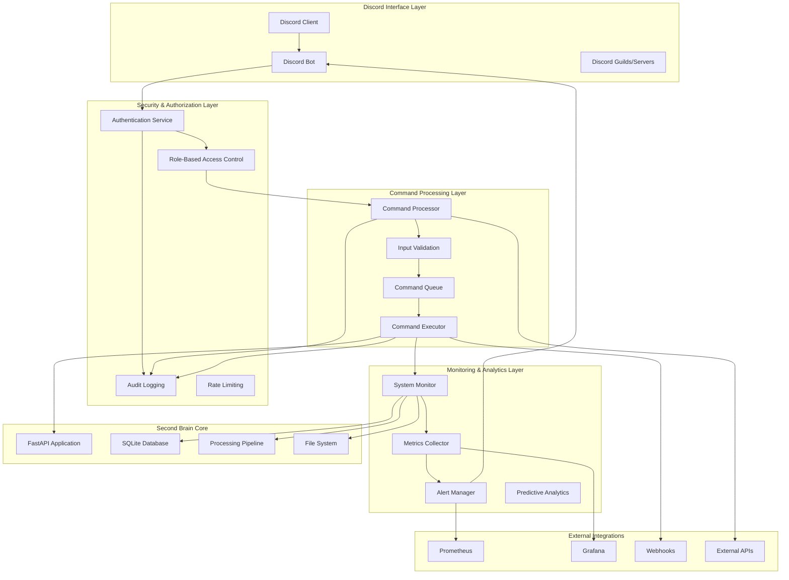
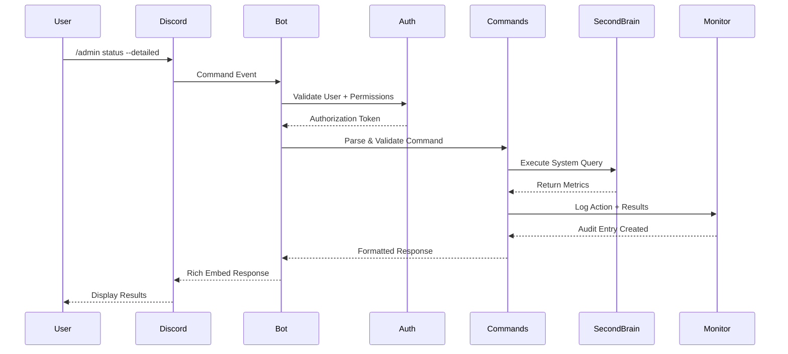
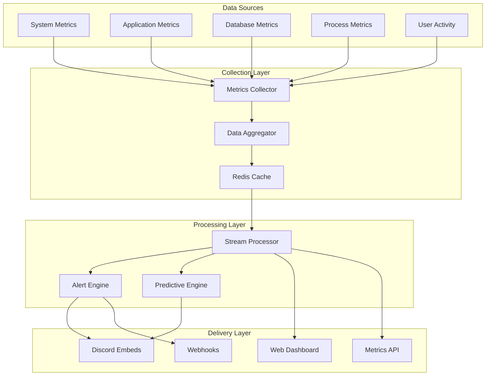

# Discord-Based Process Insights and Control System Design

**Document Version**: 1.0  
**Date**: September 1, 2025  
**Status**: Design Phase - Awaiting Security Review  
**Reviewer**: Claude Opus (Security & Architecture Review)

---

## Executive Summary

This document presents a comprehensive design for a Discord-based Process Insights and Control System that transforms Second Brain's existing Discord integration into a powerful, secure administrative and monitoring platform. The system provides real-time visibility into system operations, remote control capabilities, and predictive analytics while maintaining enterprise-grade security standards.

### Key Design Goals
- **Security First**: Multi-layer authentication, authorization, and comprehensive audit trails
- **Real-Time Visibility**: Live monitoring, alerting, and process insights through Discord's familiar interface
- **Scalable Architecture**: Support for multiple Second Brain instances with modular expansion capability
- **Enterprise Ready**: Compliance, governance, and integration features suitable for business environments

---

## Table of Contents

1. [System Architecture](#1-system-architecture)
2. [Security Framework](#2-security-framework)
3. [Command Structure](#3-command-structure)
4. [Real-Time Monitoring](#4-real-time-monitoring)
5. [Process Control Capabilities](#5-process-control-capabilities)
6. [Integration Ecosystem](#6-integration-ecosystem)
7. [Implementation Strategy](#7-implementation-strategy)
8. [Risk Assessment](#8-risk-assessment)
9. [Technical Specifications](#9-technical-specifications)
10. [Review Questions for Opus](#10-review-questions-for-opus)

---

## 1. System Architecture

### 1.1 High-Level Architecture



### 1.2 Component Architecture

#### 1.2.1 Discord Interface Layer
- **Discord Bot**: Enhanced with administrative commands and rich embed responses
- **Multi-Guild Support**: Manage multiple Second Brain instances from different Discord servers
- **Interactive Components**: Buttons, dropdowns, and modals for complex operations
- **Real-Time Updates**: Live embed updates for long-running operations

#### 1.2.2 Security & Authorization Layer
- **Multi-Factor Authentication**: Discord OAuth + API token validation
- **Role-Based Access Control**: Hierarchical permission system
- **Session Management**: Secure token lifecycle with automatic expiration
- **Audit Trail**: Comprehensive logging of all administrative actions

#### 1.2.3 Command Processing Layer
- **Command Parser**: Intelligent parsing with context validation
- **Input Sanitization**: SQL injection and command injection prevention  
- **Async Processing**: Non-blocking command execution with status updates
- **Error Recovery**: Graceful failure handling with rollback capabilities

### 1.3 Data Flow Architecture



---

## 2. Security Framework

### 2.1 Threat Model

#### 2.1.1 Threat Actors
1. **Malicious Internal Users**: Employees or authorized users attempting unauthorized access
2. **Compromised Accounts**: Legitimate accounts taken over by external attackers
3. **External Attackers**: Unauthorized individuals attempting system infiltration
4. **Privilege Escalation**: Users attempting to gain higher access levels
5. **Social Engineering**: Attempts to manipulate users into revealing credentials

#### 2.1.2 Attack Vectors
- **Command Injection**: Malicious commands embedded in Discord messages
- **Authentication Bypass**: Attempts to circumvent authorization mechanisms
- **Session Hijacking**: Stealing or manipulating authentication tokens
- **Data Exfiltration**: Unauthorized access to sensitive system information
- **Denial of Service**: Overwhelming the system with requests
- **Privilege Escalation**: Exploiting permissions to gain admin access

### 2.2 Security Controls

#### 2.2.1 Authentication Architecture

```python
# Multi-Layer Authentication Flow
class DiscordAuthenticationFlow:
    def authenticate_user(self, discord_user_id: str, command: str) -> AuthResult:
        # Layer 1: Discord OAuth validation
        discord_auth = self.validate_discord_oauth(discord_user_id)
        
        # Layer 2: Second Brain account linkage
        sb_user = self.get_linked_account(discord_user_id)
        
        # Layer 3: Command-specific permissions
        permissions = self.get_command_permissions(sb_user, command)
        
        # Layer 4: Context-based access control
        context_valid = self.validate_context(sb_user, command)
        
        # Layer 5: Rate limiting check
        rate_check = self.check_rate_limits(discord_user_id, command)
        
        return AuthResult(
            authenticated=all([discord_auth, sb_user, permissions, context_valid, rate_check]),
            permissions=permissions,
            session_token=self.generate_session_token(sb_user),
            audit_context=self.create_audit_context(discord_user_id, command)
        )
```

#### 2.2.2 Role-Based Access Control (RBAC)

```yaml
# Permission Matrix
roles:
  super_admin:
    description: "Full system control - Emergency use only"
    permissions:
      - system.shutdown
      - system.restart
      - user.manage_all
      - config.modify_all
      - audit.view_all
    restrictions:
      - requires_mfa: true
      - max_concurrent_sessions: 1
      - session_timeout: 15m
      
  system_admin:
    description: "System administration and maintenance"
    permissions:
      - system.monitor
      - system.maintenance
      - process.control
      - user.view_all
      - config.view_all
    restrictions:
      - requires_mfa: true
      - max_concurrent_sessions: 2
      - session_timeout: 30m
      
  operator:
    description: "Day-to-day operations and monitoring"
    permissions:
      - system.status
      - process.monitor
      - user.view_own
      - alerts.manage
    restrictions:
      - session_timeout: 60m
      - rate_limit: 100/hour
      
  user:
    description: "Basic user operations"
    permissions:
      - content.manage_own
      - search.execute
      - profile.view_own
    restrictions:
      - session_timeout: 24h
      - rate_limit: 1000/hour
```

#### 2.2.3 Command Authorization Matrix

| Command Category | Super Admin | System Admin | Operator | User |
|-----------------|-------------|--------------|----------|------|
| System Control | ✅ | ❌ | ❌ | ❌ |
| Process Management | ✅ | ✅ | ❌ | ❌ |
| User Management | ✅ | ✅ | ❌ | ❌ |
| System Monitoring | ✅ | ✅ | ✅ | ❌ |
| Content Operations | ✅ | ✅ | ✅ | ✅ |
| Configuration | ✅ | View Only | ❌ | ❌ |

### 2.3 Security Implementation

#### 2.3.1 Input Validation & Sanitization

```python
class SecureCommandValidator:
    DANGEROUS_PATTERNS = [
        r'(\||;|&|\$\(|\`)',  # Command injection
        r'(DROP|DELETE|UPDATE|INSERT)\s+',  # SQL injection attempts
        r'(\.\.\/|\.\.\|\|)',  # Path traversal
        r'(eval\(|exec\(|import\s+)',  # Code injection
    ]
    
    def validate_command_input(self, command: str, args: dict) -> ValidationResult:
        # 1. Pattern-based validation
        for pattern in self.DANGEROUS_PATTERNS:
            if re.search(pattern, command, re.IGNORECASE):
                return ValidationResult(valid=False, reason="Dangerous pattern detected")
        
        # 2. Whitelist validation
        if not self.is_whitelisted_command(command):
            return ValidationResult(valid=False, reason="Command not in whitelist")
        
        # 3. Parameter validation
        for key, value in args.items():
            if not self.validate_parameter(key, value):
                return ValidationResult(valid=False, reason=f"Invalid parameter: {key}")
        
        # 4. Context validation
        if not self.validate_execution_context(command, args):
            return ValidationResult(valid=False, reason="Invalid execution context")
        
        return ValidationResult(valid=True)
```

#### 2.3.2 Audit Logging

```python
class AuditLogger:
    def log_command_execution(self, context: AuditContext) -> None:
        audit_entry = {
            "timestamp": datetime.utcnow().isoformat(),
            "discord_user_id": context.discord_user_id,
            "discord_guild_id": context.guild_id,
            "second_brain_user_id": context.sb_user_id,
            "command": context.command,
            "parameters": self.sanitize_parameters(context.parameters),
            "ip_address": context.ip_address,
            "user_agent": context.user_agent,
            "session_id": context.session_id,
            "result": context.result,
            "execution_time_ms": context.execution_time,
            "error_message": context.error_message,
            "security_level": self.calculate_security_level(context.command),
            "risk_score": self.calculate_risk_score(context)
        }
        
        # Multiple logging destinations
        self.log_to_database(audit_entry)
        self.log_to_file(audit_entry)
        
        # High-risk actions get additional logging
        if audit_entry["risk_score"] > 7:
            self.log_to_siem(audit_entry)
            self.notify_security_team(audit_entry)
```

---

## 3. Command Structure

### 3.1 Command Hierarchy

```
/admin
├── system
│   ├── status [--detailed] [--component=<name>]
│   ├── health [--full-check] [--export]
│   ├── restart [--service=<name>] [--graceful]
│   ├── shutdown [--graceful] [--timeout=<seconds>]
│   └── maintenance [--enable|--disable] [--message=<text>]
├── process
│   ├── monitor [--live] [--filter=<type>]
│   ├── queue [--action=pause|resume|clear] [--type=<queue>]
│   ├── jobs [--list|--kill] [--id=<job_id>]
│   └── priority [--set] [--job=<id>] [--level=<1-10>]
├── users
│   ├── list [--role=<role>] [--active]
│   ├── inspect [--user=<id>] [--detailed]
│   ├── permissions [--user=<id>] [--grant|--revoke] [--permission=<perm>]
│   └── sessions [--list|--terminate] [--user=<id>]
├── analytics
│   ├── dashboard [--timeframe=<period>]
│   ├── performance [--component=<name>] [--metrics]
│   ├── usage [--breakdown=<type>] [--export]
│   └── alerts [--list|--configure] [--type=<alert_type>]
└── config
    ├── view [--section=<name>] [--secure]
    ├── set [--key=<name>] [--value=<val>] [--validate]
    └── reload [--section=<name>] [--restart-required]
```

### 3.2 Command Specifications

#### 3.2.1 System Commands

```python
@admin_command(permission="system.status", risk_level=2)
async def system_status(
    interaction: discord.Interaction,
    detailed: bool = False,
    component: str = None,
    export: bool = False
):
    """
    Display comprehensive system status information.
    
    Parameters:
    - detailed: Include detailed metrics and performance data
    - component: Filter status for specific component (api, database, queue, etc.)
    - export: Generate downloadable status report
    
    Security: Requires system.status permission, logs to audit trail
    """
    
@admin_command(permission="system.restart", risk_level=8)
async def system_restart(
    interaction: discord.Interaction,
    service: str = "all",
    graceful: bool = True,
    timeout: int = 30
):
    """
    Restart system services with optional graceful shutdown.
    
    Parameters:
    - service: Specific service to restart (api, queue, monitor) or "all"
    - graceful: Perform graceful shutdown waiting for current operations
    - timeout: Maximum wait time for graceful shutdown
    
    Security: Requires system.restart permission, high-risk operation
    """
```

#### 3.2.2 Process Management Commands

```python
@admin_command(permission="process.monitor", risk_level=3)
async def process_monitor(
    interaction: discord.Interaction,
    live: bool = False,
    filter_type: str = None,
    duration: int = 60
):
    """
    Monitor system processes in real-time.
    
    Parameters:
    - live: Enable live monitoring with periodic updates
    - filter_type: Filter by process type (audio, text, image, etc.)
    - duration: Duration for live monitoring in seconds
    
    Returns: Interactive embed with process statistics and controls
    """

@admin_command(permission="process.control", risk_level=6)
async def queue_control(
    interaction: discord.Interaction,
    action: str,
    queue_type: str = "all",
    force: bool = False
):
    """
    Control processing queues (pause, resume, clear).
    
    Parameters:
    - action: Action to perform (pause, resume, clear, drain)
    - queue_type: Type of queue (audio, text, image, all)
    - force: Force action even if operations are pending
    
    Security: High-risk operation, requires confirmation for destructive actions
    """
```

### 3.3 Interactive Command Components

```python
class InteractiveCommandBuilder:
    def create_system_dashboard(self) -> discord.Embed:
        embed = discord.Embed(
            title="🖥️ Second Brain System Dashboard",
            color=0x00ff00 if self.system_healthy else 0xff0000
        )
        
        # System metrics
        embed.add_field(
            name="💡 System Status",
            value=f"Health: {self.health_indicator}\nUptime: {self.uptime}\nLoad: {self.system_load}",
            inline=True
        )
        
        # Interactive buttons
        view = SystemControlView()
        view.add_item(Button(label="Refresh", style=ButtonStyle.primary))
        view.add_item(Button(label="Detailed Report", style=ButtonStyle.secondary))
        view.add_item(Button(label="Export Logs", style=ButtonStyle.secondary))
        
        return embed, view

class SystemControlView(discord.ui.View):
    @discord.ui.button(label="Emergency Stop", style=discord.ButtonStyle.danger)
    async def emergency_stop(self, interaction: discord.Interaction, button: discord.ui.Button):
        # Requires super_admin confirmation
        await self.request_emergency_confirmation(interaction)
    
    @discord.ui.select(placeholder="Select system component...")
    async def component_selector(self, interaction: discord.Interaction, select: discord.ui.Select):
        # Dynamic component management
        await self.handle_component_selection(interaction, select.values[0])
```

---

## 4. Real-Time Monitoring

### 4.1 Monitoring Architecture



### 4.2 Monitoring Metrics

#### 4.2.1 System Health Metrics

```python
class SystemHealthMonitor:
    def collect_health_metrics(self) -> Dict[str, Any]:
        return {
            "system": {
                "cpu_usage_percent": psutil.cpu_percent(interval=1),
                "memory_usage_percent": psutil.virtual_memory().percent,
                "disk_usage_percent": psutil.disk_usage('/').percent,
                "network_io": psutil.net_io_counters(),
                "load_average": os.getloadavg(),
                "uptime_seconds": time.time() - psutil.boot_time()
            },
            "application": {
                "active_connections": self.get_active_connections(),
                "request_rate_per_minute": self.get_request_rate(),
                "response_time_avg_ms": self.get_avg_response_time(),
                "error_rate_percent": self.get_error_rate(),
                "queue_depth": self.get_queue_depth(),
                "cache_hit_rate": self.get_cache_hit_rate()
            },
            "database": {
                "query_rate_per_second": self.get_query_rate(),
                "slow_queries_count": self.get_slow_queries(),
                "connection_pool_usage": self.get_connection_pool_usage(),
                "index_usage_efficiency": self.get_index_efficiency(),
                "database_size_mb": self.get_database_size()
            },
            "processing": {
                "audio_queue_depth": self.get_audio_queue_depth(),
                "processing_rate_per_minute": self.get_processing_rate(),
                "failed_jobs_count": self.get_failed_jobs(),
                "average_processing_time_ms": self.get_avg_processing_time(),
                "transcription_accuracy": self.get_transcription_accuracy()
            }
        }
```

#### 4.2.2 Alert Thresholds & Rules

```yaml
alert_rules:
  critical:
    - metric: system.cpu_usage_percent
      threshold: 90
      duration: 5m
      action: immediate_notification
      
    - metric: system.memory_usage_percent  
      threshold: 95
      duration: 2m
      action: immediate_notification + auto_cleanup
      
    - metric: application.error_rate_percent
      threshold: 10
      duration: 1m
      action: immediate_notification + health_check
      
  warning:
    - metric: database.slow_queries_count
      threshold: 50
      duration: 10m
      action: performance_analysis
      
    - metric: processing.failed_jobs_count
      threshold: 100
      duration: 15m
      action: queue_analysis + retry_failed
      
  predictive:
    - metric: system.disk_usage_percent
      prediction_window: 7d
      threshold: 85
      action: capacity_planning_alert
      
    - metric: processing.queue_depth
      prediction_window: 24h
      threshold: 1000
      action: scaling_recommendation
```

### 4.3 Live Dashboard Implementation

```python
class LiveDiscordDashboard:
    def __init__(self):
        self.update_interval = 30  # seconds
        self.active_dashboards = {}
        
    async def create_live_dashboard(self, channel: discord.TextChannel, user_id: int) -> None:
        """Create a live-updating dashboard in Discord channel"""
        
        # Create initial dashboard embed
        embed = await self.build_dashboard_embed()
        message = await channel.send(embed=embed, view=DashboardControlView())
        
        # Register for live updates
        self.active_dashboards[message.id] = {
            "message": message,
            "user_id": user_id,
            "last_update": time.time(),
            "update_count": 0
        }
        
        # Start update task
        asyncio.create_task(self.update_dashboard_loop(message.id))
        
    async def build_dashboard_embed(self) -> discord.Embed:
        metrics = await self.collect_live_metrics()
        
        embed = discord.Embed(
            title="🔴 LIVE Second Brain System Dashboard",
            description=f"Last Update: {datetime.utcnow().strftime('%H:%M:%S UTC')}",
            color=self.get_health_color(metrics)
        )
        
        # System Status Section
        embed.add_field(
            name="🖥️ System Health",
            value=f"""
            CPU: {metrics['cpu']}% {self.get_trend_indicator('cpu')}
            Memory: {metrics['memory']}% {self.get_trend_indicator('memory')}
            Disk: {metrics['disk']}% {self.get_trend_indicator('disk')}
            """,
            inline=True
        )
        
        # Processing Status Section
        embed.add_field(
            name="⚙️ Processing Queue",
            value=f"""
            Audio: {metrics['audio_queue']} pending
            Text: {metrics['text_queue']} pending  
            Failed: {metrics['failed_jobs']} jobs
            """,
            inline=True
        )
        
        # Performance Metrics Section
        embed.add_field(
            name="📊 Performance",
            value=f"""
            Requests/min: {metrics['request_rate']}
            Avg Response: {metrics['response_time']}ms
            Error Rate: {metrics['error_rate']}%
            """,
            inline=True
        )
        
        return embed
        
    async def update_dashboard_loop(self, message_id: int) -> None:
        """Continuous update loop for live dashboard"""
        while message_id in self.active_dashboards:
            try:
                dashboard = self.active_dashboards[message_id]
                
                # Update embed
                new_embed = await self.build_dashboard_embed()
                await dashboard["message"].edit(embed=new_embed)
                
                # Update tracking
                dashboard["last_update"] = time.time()
                dashboard["update_count"] += 1
                
                # Check for stale dashboards (remove after 1 hour)
                if dashboard["update_count"] > 120:  # 30s * 120 = 1 hour
                    await self.cleanup_dashboard(message_id)
                    break
                    
                await asyncio.sleep(self.update_interval)
                
            except Exception as e:
                logger.error(f"Dashboard update error: {e}")
                await self.cleanup_dashboard(message_id)
                break
```

---

## 5. Process Control Capabilities

### 5.1 Process Control Architecture

```python
class ProcessControlManager:
    def __init__(self):
        self.controlled_processes = {
            "api_server": FastAPIProcessController(),
            "audio_processor": AudioProcessController(), 
            "background_tasks": BackgroundTaskController(),
            "database_maintenance": DatabaseController(),
            "file_watcher": FileWatcherController()
        }
        
    async def execute_control_command(
        self, 
        command: ControlCommand, 
        user_context: UserContext
    ) -> ControlResult:
        
        # Security validation
        if not self.validate_control_permission(command, user_context):
            raise UnauthorizedError("Insufficient permissions for process control")
            
        # Pre-execution safety checks
        safety_check = await self.perform_safety_check(command)
        if not safety_check.safe:
            raise SafetyError(f"Safety check failed: {safety_check.reason}")
            
        # Execute with rollback capability
        rollback_point = await self.create_rollback_point(command.target_process)
        
        try:
            result = await self.execute_process_command(command)
            await self.log_control_action(command, user_context, result)
            return result
            
        except Exception as e:
            await self.rollback_to_point(rollback_point)
            await self.log_control_failure(command, user_context, e)
            raise
```

### 5.2 Safe Process Control Operations

#### 5.2.1 Graceful Service Restart

```python
class GracefulRestartController:
    async def graceful_restart_service(
        self, 
        service_name: str, 
        timeout: int = 60
    ) -> RestartResult:
        
        # Phase 1: Preparation
        await self.notify_users_of_maintenance(service_name)
        await self.stop_accepting_new_requests(service_name)
        
        # Phase 2: Drain existing requests
        active_requests = await self.wait_for_request_completion(timeout=timeout//2)
        if active_requests > 0:
            await self.force_complete_requests(active_requests)
            
        # Phase 3: Graceful shutdown
        await self.save_process_state(service_name)
        shutdown_result = await self.shutdown_service(service_name, graceful=True)
        
        # Phase 4: Health verification before restart
        health_check = await self.verify_system_health()
        if not health_check.healthy:
            raise RestartError("System not healthy enough for restart")
            
        # Phase 5: Restart service
        start_result = await self.start_service(service_name)
        
        # Phase 6: Verify restart success
        verification = await self.verify_service_health(service_name, timeout=30)
        
        # Phase 7: Resume normal operations
        await self.resume_accepting_requests(service_name)
        await self.notify_users_of_completion(service_name)
        
        return RestartResult(
            success=verification.healthy,
            duration_seconds=time.time() - start_time,
            services_restarted=[service_name],
            requests_completed=active_requests
        )
```

#### 5.2.2 Queue Management Operations

```python
class QueueController:
    async def pause_queue(self, queue_type: str, reason: str) -> None:
        """Pause processing queue while preserving job state"""
        
        # Get current queue state
        current_jobs = await self.get_active_jobs(queue_type)
        
        # Allow current jobs to complete (up to 5 minutes)
        await self.wait_for_job_completion(current_jobs, timeout=300)
        
        # Set queue to paused state
        await self.set_queue_state(queue_type, QueueState.PAUSED, reason)
        
        # Notify monitoring systems
        await self.emit_queue_event(QueueEvent.PAUSED, queue_type, reason)
        
    async def resume_queue(self, queue_type: str) -> None:
        """Resume paused queue processing"""
        
        # Verify system health before resuming
        health_check = await self.check_processing_health()
        if not health_check.can_process:
            raise QueueError(f"Cannot resume queue: {health_check.reason}")
            
        # Resume queue processing
        await self.set_queue_state(queue_type, QueueState.ACTIVE)
        
        # Process any backlogged items
        backlog = await self.get_queue_backlog(queue_type)
        await self.schedule_backlog_processing(backlog)
        
    async def clear_failed_jobs(self, queue_type: str, max_age_hours: int = 24) -> ClearResult:
        """Clear failed jobs older than specified age"""
        
        # Safety check: don't clear recent failures (might be transient)
        cutoff_time = datetime.utcnow() - timedelta(hours=max_age_hours)
        
        failed_jobs = await self.get_failed_jobs(
            queue_type=queue_type,
            older_than=cutoff_time
        )
        
        # Archive failed job data before clearing
        archive_result = await self.archive_failed_jobs(failed_jobs)
        
        # Clear the failed jobs
        clear_count = await self.remove_failed_jobs(failed_jobs)
        
        return ClearResult(
            cleared_count=clear_count,
            archived_count=len(failed_jobs),
            archive_location=archive_result.location
        )
```

### 5.3 Emergency Controls

```python
class EmergencyController:
    async def emergency_shutdown(
        self, 
        reason: str, 
        authorized_by: str,
        timeout: int = 30
    ) -> EmergencyResult:
        """Emergency system shutdown with minimal data loss"""
        
        logger.critical(f"EMERGENCY SHUTDOWN initiated by {authorized_by}: {reason}")
        
        # Immediate actions (0-5 seconds)
        await self.stop_accepting_requests()
        await self.notify_emergency_contacts()
        await self.enable_maintenance_mode()
        
        # Critical data protection (5-15 seconds)
        await self.flush_all_caches()
        await self.force_database_checkpoint()
        await self.backup_critical_state()
        
        # Graceful service termination (15-30 seconds)
        active_operations = await self.get_active_operations()
        await self.terminate_operations_gracefully(active_operations, timeout=15)
        
        # Force termination if necessary
        remaining_operations = await self.get_active_operations()
        if remaining_operations:
            await self.force_terminate_operations(remaining_operations)
            
        # Final shutdown
        await self.shutdown_all_services()
        
        return EmergencyResult(
            shutdown_completed=True,
            data_preserved=True,
            operations_terminated=len(active_operations),
            shutdown_duration_seconds=time.time() - start_time
        )
    
    async def maintenance_mode(self, enable: bool, message: str = None) -> None:
        """Enable/disable maintenance mode"""
        
        if enable:
            # Enable maintenance mode
            await self.set_system_flag("maintenance_mode", True)
            await self.set_maintenance_message(message or "System maintenance in progress")
            await self.redirect_traffic_to_maintenance_page()
            
            # Notify users
            await self.broadcast_maintenance_notification(message)
            
        else:
            # Disable maintenance mode
            await self.verify_system_health_for_resumption()
            await self.set_system_flag("maintenance_mode", False)
            await self.restore_normal_traffic_routing()
            
            # Notify users
            await self.broadcast_maintenance_completion()
```

---

## 6. Integration Ecosystem

### 6.1 External Monitoring Integration

```python
class MonitoringIntegrations:
    def __init__(self):
        self.prometheus_client = PrometheusClient()
        self.grafana_client = GrafanaClient()
        self.webhook_manager = WebhookManager()
        
    async def export_metrics_to_prometheus(self) -> None:
        """Export Second Brain metrics to Prometheus"""
        
        metrics = await self.collect_all_metrics()
        
        # System metrics
        self.prometheus_client.gauge('second_brain_cpu_usage').set(metrics['cpu_usage'])
        self.prometheus_client.gauge('second_brain_memory_usage').set(metrics['memory_usage'])
        
        # Application metrics
        self.prometheus_client.counter('second_brain_requests_total').inc(metrics['request_count'])
        self.prometheus_client.histogram('second_brain_response_time').observe(metrics['response_time'])
        
        # Processing metrics
        self.prometheus_client.gauge('second_brain_queue_depth').set(metrics['queue_depth'])
        self.prometheus_client.counter('second_brain_jobs_processed').inc(metrics['jobs_processed'])
        
    async def create_grafana_dashboard(self) -> str:
        """Auto-create Grafana dashboard for Second Brain"""
        
        dashboard_config = {
            "dashboard": {
                "title": "Second Brain System Monitor",
                "panels": [
                    self.create_system_health_panel(),
                    self.create_processing_queue_panel(),
                    self.create_user_activity_panel(),
                    self.create_performance_panel()
                ],
                "time": {"from": "now-1h", "to": "now"},
                "refresh": "30s"
            }
        }
        
        result = await self.grafana_client.create_dashboard(dashboard_config)
        return result.dashboard_url
```

### 6.2 Webhook Notification System

```python
class WebhookManager:
    def __init__(self):
        self.webhook_endpoints = self.load_webhook_config()
        
    async def send_alert_webhook(self, alert: Alert) -> None:
        """Send alert to configured webhook endpoints"""
        
        payload = {
            "timestamp": alert.timestamp.isoformat(),
            "alert_type": alert.type,
            "severity": alert.severity,
            "component": alert.component,
            "message": alert.message,
            "metrics": alert.metrics,
            "suggested_actions": alert.suggested_actions,
            "dashboard_url": self.get_dashboard_url(alert.component)
        }
        
        # Send to all configured endpoints
        for endpoint in self.webhook_endpoints:
            try:
                await self.send_webhook(endpoint, payload)
            except Exception as e:
                logger.error(f"Webhook delivery failed to {endpoint.url}: {e}")
                
    async def register_webhook_endpoint(
        self, 
        url: str, 
        secret: str, 
        events: List[str]
    ) -> str:
        """Register new webhook endpoint"""
        
        endpoint = WebhookEndpoint(
            id=str(uuid.uuid4()),
            url=url,
            secret=secret,
            events=events,
            created_at=datetime.utcnow()
        )
        
        # Validate endpoint
        validation_result = await self.validate_webhook_endpoint(endpoint)
        if not validation_result.valid:
            raise WebhookError(f"Endpoint validation failed: {validation_result.reason}")
            
        # Store endpoint
        await self.store_webhook_endpoint(endpoint)
        
        return endpoint.id
```

---

## 7. Implementation Strategy

### 7.1 Development Phases

#### Phase 1: Foundation (Weeks 1-2)
**Scope**: Core security and command infrastructure
- Multi-layer authentication system
- Role-based access control implementation
- Audit logging framework
- Basic command processing pipeline
- Input validation and sanitization

**Deliverables**:
- Enhanced Discord bot with admin command framework
- Security middleware implementation
- Database schema updates for RBAC and audit logging
- Basic admin commands (/admin status, /admin health)

**Risk Level**: Medium - Foundation changes require careful testing

#### Phase 2: Monitoring & Analytics (Weeks 3-4)
**Scope**: Real-time monitoring and system insights
- Live dashboard implementation
- Metrics collection and aggregation
- Alert engine development
- Basic process control commands

**Deliverables**:
- Live Discord dashboards with auto-refresh
- Comprehensive metrics collection system
- Alert rules engine with Discord notifications
- Process monitoring commands (/admin process monitor, /admin queue)

**Risk Level**: Low - Primarily read-only monitoring features

#### Phase 3: Process Control (Weeks 5-6)
**Scope**: Safe process management and control operations
- Graceful service restart mechanisms
- Queue management operations
- Emergency control systems
- Advanced user management

**Deliverables**:
- Safe restart and shutdown procedures
- Queue pause/resume/clear operations
- Emergency maintenance mode
- Advanced admin commands (/admin system restart, /admin queue control)

**Risk Level**: High - Direct system control operations

#### Phase 4: Integration & Analytics (Weeks 7-8)
**Scope**: External integrations and advanced analytics
- Prometheus/Grafana integration
- Webhook notification system
- Predictive analytics engine
- Advanced security features

**Deliverables**:
- External monitoring tool integrations
- Webhook-based alert routing
- Predictive failure detection
- Advanced security controls and MFA

**Risk Level**: Medium - External integrations require careful configuration

### 7.2 Rollout Strategy

#### Development Environment Testing
```bash
# Phase 1: Local testing with mock Discord server
1. Set up isolated test environment
2. Create test Discord server with controlled user base
3. Implement and test core security features
4. Validate authentication and authorization flows

# Phase 2: Staging environment deployment
1. Deploy to staging Second Brain instance
2. Test with production-like data volumes
3. Perform load testing on monitoring systems
4. Validate alert thresholds and notification routing

# Phase 3: Limited production rollout
1. Deploy to production with admin-only access
2. Monitor system performance and security
3. Gradually expand access to trusted operators
4. Collect user feedback and performance metrics

# Phase 4: Full production deployment
1. Complete feature rollout to all authorized users
2. Implement final security hardening
3. Complete documentation and training
4. Establish ongoing monitoring and maintenance procedures
```

#### Security Validation Process
```python
class SecurityValidationSuite:
    def run_security_tests(self) -> SecurityTestResult:
        results = []
        
        # Authentication bypass attempts
        results.append(self.test_authentication_bypass())
        
        # Command injection prevention
        results.append(self.test_command_injection_prevention())
        
        # Privilege escalation attempts  
        results.append(self.test_privilege_escalation_prevention())
        
        # Rate limiting effectiveness
        results.append(self.test_rate_limiting())
        
        # Audit logging completeness
        results.append(self.test_audit_logging_completeness())
        
        # Session security
        results.append(self.test_session_security())
        
        return SecurityTestResult(
            tests_passed=sum(1 for r in results if r.passed),
            tests_failed=sum(1 for r in results if not r.passed),
            critical_issues=[r for r in results if not r.passed and r.severity == 'critical'],
            overall_security_score=self.calculate_security_score(results)
        )
```

### 7.3 Performance Considerations

#### Scalability Metrics
```python
class PerformanceRequirements:
    RESPONSE_TIME_TARGETS = {
        "command_processing": "< 2000ms",
        "dashboard_updates": "< 5000ms", 
        "live_monitoring": "< 1000ms",
        "alert_generation": "< 500ms"
    }
    
    THROUGHPUT_TARGETS = {
        "concurrent_admin_users": 10,
        "commands_per_minute": 100,
        "dashboard_updates_per_second": 5,
        "metrics_collection_rate": "1/second"
    }
    
    RESOURCE_LIMITS = {
        "memory_overhead": "< 100MB",
        "cpu_overhead": "< 10%",
        "database_queries_per_command": "< 5",
        "discord_api_rate_limit_usage": "< 50%"
    }
```

---

## 8. Risk Assessment

### 8.1 Security Risks

| Risk Category | Risk Level | Probability | Impact | Mitigation Strategy |
|--------------|------------|-------------|---------|-------------------|
| Authentication Bypass | HIGH | Medium | Critical | Multi-layer auth, rate limiting, audit logging |
| Privilege Escalation | HIGH | Low | Critical | RBAC, input validation, session management |
| Command Injection | MEDIUM | Medium | High | Input sanitization, command whitelisting |
| Data Exfiltration | MEDIUM | Low | High | Access controls, audit logging, encryption |
| DoS Attacks | MEDIUM | High | Medium | Rate limiting, resource monitoring |
| Session Hijacking | LOW | Low | Medium | Secure tokens, session timeout |

### 8.2 Operational Risks

| Risk Category | Risk Level | Probability | Impact | Mitigation Strategy |
|--------------|------------|-------------|---------|-------------------|
| Accidental System Shutdown | HIGH | Medium | High | Confirmation dialogs, rollback capability |
| Configuration Corruption | MEDIUM | Low | High | Config validation, backup/restore |
| Performance Degradation | MEDIUM | Medium | Medium | Performance monitoring, auto-scaling |
| Discord API Outage | LOW | Low | Medium | Graceful degradation, alternative interfaces |
| Database Corruption | LOW | Very Low | Critical | Regular backups, integrity checks |

### 8.3 Risk Mitigation Strategies

#### Critical Risk Controls
```python
class RiskMitigationControls:
    
    # Authentication bypass prevention
    AUTHENTICATION_CONTROLS = [
        "multi_layer_validation",
        "token_rotation", 
        "session_timeout",
        "failed_attempt_lockout",
        "audit_trail_monitoring"
    ]
    
    # Accidental damage prevention
    SAFETY_CONTROLS = [
        "confirmation_dialogs_for_destructive_ops",
        "rollback_points_before_changes",
        "read_only_mode_for_inspection",
        "gradual_rollout_of_changes",
        "automatic_backup_before_modifications"
    ]
    
    # Performance protection
    PERFORMANCE_CONTROLS = [
        "resource_usage_monitoring",
        "automatic_throttling",
        "circuit_breakers",
        "graceful_degradation",
        "load_shedding_mechanisms"
    ]
```

---

## 9. Technical Specifications

### 9.1 Database Schema Extensions

```sql
-- Role-based access control tables
CREATE TABLE admin_roles (
    id INTEGER PRIMARY KEY AUTOINCREMENT,
    name TEXT UNIQUE NOT NULL,
    description TEXT,
    permissions TEXT NOT NULL, -- JSON array
    restrictions TEXT, -- JSON object
    created_at TIMESTAMP DEFAULT CURRENT_TIMESTAMP
);

CREATE TABLE user_role_assignments (
    id INTEGER PRIMARY KEY AUTOINCREMENT,
    user_id INTEGER NOT NULL,
    discord_user_id TEXT,
    role_id INTEGER NOT NULL,
    assigned_by INTEGER,
    assigned_at TIMESTAMP DEFAULT CURRENT_TIMESTAMP,
    expires_at TIMESTAMP,
    FOREIGN KEY (user_id) REFERENCES users (id),
    FOREIGN KEY (role_id) REFERENCES admin_roles (id),
    FOREIGN KEY (assigned_by) REFERENCES users (id)
);

-- Audit logging table
CREATE TABLE admin_audit_log (
    id INTEGER PRIMARY KEY AUTOINCREMENT,
    timestamp TIMESTAMP DEFAULT CURRENT_TIMESTAMP,
    discord_user_id TEXT NOT NULL,
    user_id INTEGER,
    command TEXT NOT NULL,
    parameters TEXT, -- JSON
    result TEXT,
    error_message TEXT,
    execution_time_ms INTEGER,
    ip_address TEXT,
    session_id TEXT,
    risk_score INTEGER,
    FOREIGN KEY (user_id) REFERENCES users (id)
);

-- System metrics table
CREATE TABLE system_metrics (
    id INTEGER PRIMARY KEY AUTOINCREMENT,
    timestamp TIMESTAMP DEFAULT CURRENT_TIMESTAMP,
    metric_name TEXT NOT NULL,
    metric_value REAL NOT NULL,
    metric_unit TEXT,
    component TEXT,
    tags TEXT -- JSON object
);

-- Alert configuration table
CREATE TABLE alert_rules (
    id INTEGER PRIMARY KEY AUTOINCREMENT,
    name TEXT UNIQUE NOT NULL,
    metric_name TEXT NOT NULL,
    threshold_value REAL NOT NULL,
    comparison_operator TEXT NOT NULL,
    duration_seconds INTEGER DEFAULT 300,
    severity TEXT NOT NULL,
    enabled BOOLEAN DEFAULT TRUE,
    notification_channels TEXT, -- JSON array
    created_at TIMESTAMP DEFAULT CURRENT_TIMESTAMP
);
```

### 9.2 Configuration Extensions

```python
# config.py extensions
class AdminConfig(BaseSettings):
    # Security settings
    admin_session_timeout_minutes: int = 30
    max_failed_auth_attempts: int = 5
    auth_lockout_duration_minutes: int = 15
    require_mfa_for_high_risk_commands: bool = True
    
    # Rate limiting
    admin_commands_per_minute: int = 20
    dashboard_updates_per_minute: int = 60
    
    # Monitoring settings
    metrics_collection_interval_seconds: int = 30
    dashboard_auto_refresh_seconds: int = 30
    alert_evaluation_interval_seconds: int = 60
    
    # Performance settings
    max_concurrent_admin_sessions: int = 10
    command_timeout_seconds: int = 300
    dashboard_history_retention_days: int = 30
    
    # External integrations
    prometheus_enabled: bool = False
    prometheus_port: int = 9090
    grafana_enabled: bool = False
    grafana_url: str = "http://localhost:3000"
    
    # Emergency controls
    emergency_contacts: List[str] = []
    emergency_shutdown_timeout_seconds: int = 30
    maintenance_mode_message: str = "System maintenance in progress"
```

### 9.3 API Extensions

```python
# FastAPI routes for admin functionality
@app.post("/api/admin/authenticate")
async def admin_authenticate(credentials: AdminCredentials) -> AuthToken:
    """Enhanced authentication for admin users"""
    pass

@app.get("/api/admin/metrics/live")
async def get_live_metrics(auth: AuthToken = Depends(verify_admin_auth)) -> LiveMetrics:
    """Real-time metrics for dashboard"""
    pass

@app.post("/api/admin/control/{action}")
async def execute_control_command(
    action: str,
    parameters: dict,
    auth: AuthToken = Depends(verify_admin_auth)
) -> ControlResult:
    """Execute process control commands"""
    pass

@app.get("/api/admin/audit/{user_id}")
async def get_audit_trail(
    user_id: int,
    auth: AuthToken = Depends(verify_admin_auth)
) -> List[AuditEntry]:
    """Retrieve audit trail for user"""
    pass
```

---

## 10. Review Questions for Opus

### 10.1 Security Architecture Review

**Critical Security Questions:**

1. **Authentication & Authorization**:
   - Is the multi-layer authentication approach sufficiently robust?
   - Are there any gaps in the RBAC permission model?
   - Should we implement additional factors beyond Discord OAuth + API tokens?

2. **Input Validation & Injection Prevention**:
   - Is the command input validation comprehensive enough?
   - Are there any attack vectors not covered by the current sanitization approach?
   - Should we implement additional sandboxing for command execution?

3. **Session Management**:
   - Are the session timeout policies appropriate for different user roles?
   - Is the session token generation and validation secure?
   - Should we implement concurrent session limits per user?

4. **Audit & Monitoring**:
   - Is the audit logging comprehensive enough for compliance requirements?
   - Are there any security events that should trigger immediate alerts?
   - Should we implement additional behavioral anomaly detection?

### 10.2 Architecture & Scalability Review

**System Design Questions:**

1. **Performance & Scalability**:
   - Will the real-time monitoring system scale with increased user load?
   - Are the database queries optimized for performance at scale?
   - Should we implement caching layers for frequently accessed data?

2. **Reliability & Fault Tolerance**:
   - Are there single points of failure in the monitoring architecture?
   - Is the emergency shutdown procedure comprehensive enough?
   - Should we implement automatic failover mechanisms?

3. **Integration Complexity**:
   - Is the external monitoring integration (Prometheus/Grafana) necessary for MVP?
   - Are the webhook notification systems robust enough for production use?
   - Should we prioritize Discord-native features over external integrations?

### 10.3 Implementation Strategy Review

**Development & Deployment Questions:**

1. **Phase Planning**:
   - Is the 8-week implementation timeline realistic for the scope?
   - Should any phases be broken down further or reordered?
   - Are there any dependencies that could cause delays?

2. **Risk Management**:
   - Are the identified risks comprehensive and properly prioritized?
   - Are the mitigation strategies sufficient for each risk category?
   - Should we implement additional safeguards before production deployment?

3. **Testing Strategy**:
   - Is the security validation suite comprehensive enough?
   - Should we implement additional load testing for the monitoring systems?
   - Are there any edge cases that need specific test coverage?

### 10.4 Business & User Experience Review

**Product Strategy Questions:**

1. **Feature Prioritization**:
   - Are we building the right features for the target user base?
   - Should some advanced features be deferred to focus on core functionality?
   - Is the Discord interface the best choice for all administrative tasks?

2. **User Experience**:
   - Will the command structure be intuitive for non-technical users?
   - Are the interactive components (buttons, dropdowns) necessary or distracting?
   - Should we provide alternative interfaces (web dashboard) alongside Discord?

3. **Competitive Advantage**:
   - Does this Discord-based approach provide sufficient differentiation?
   - Are there simpler solutions that would meet 80% of the requirements?
   - Should we focus on integration with existing monitoring tools instead?

### 10.5 Specific Technical Concerns

**Implementation Details:**

1. **Discord API Limitations**:
   - Are we approaching Discord's rate limits with the planned monitoring frequency?
   - Will Discord's message/embed size limits constrain our dashboard features?
   - Should we implement fallback mechanisms for Discord API outages?

2. **Database Performance**:
   - Will the SQLite database handle the metrics collection volume at scale?
   - Should we consider database sharding or alternative storage for metrics?
   - Are the audit logging queries optimized for performance?

3. **Error Handling**:
   - Are there sufficient safeguards against partial failures?
   - Is the rollback mechanism comprehensive enough for all control operations?
   - Should we implement additional circuit breakers and timeout mechanisms?

---

## Conclusion

This Discord-based Process Insights and Control System design represents a comprehensive approach to remote system administration through a familiar, accessible interface. The design prioritizes security through multiple validation layers while providing powerful real-time monitoring and control capabilities.

**Key Strengths of the Design:**
- **Security-First Architecture** with multi-layer validation and comprehensive audit trails
- **Familiar User Interface** leveraging Discord's established interaction patterns
- **Comprehensive Monitoring** with real-time dashboards and predictive analytics
- **Safe Process Control** with confirmation dialogs, rollback capabilities, and emergency controls
- **Scalable Foundation** with modular architecture supporting multiple Second Brain instances

**Areas Requiring Careful Implementation:**
- **Command Input Validation** must be bulletproof to prevent injection attacks
- **Session Management** requires careful balance between security and usability
- **Performance Optimization** for real-time monitoring at scale
- **Error Recovery** mechanisms for partial failures and network issues

**Recommended Next Steps:**
1. **Security Review** by experienced security architect (Opus)
2. **Prototype Development** focusing on core authentication and basic commands
3. **Load Testing** of monitoring systems with realistic data volumes
4. **User Experience Testing** with target administrator personas

This design provides a solid foundation for transforming Second Brain's Discord integration into a powerful administrative platform while maintaining the security, reliability, and user experience standards required for production deployment.

---

**Document Status**: Ready for Opus Security & Architecture Review  
**Next Review Date**: Upon Opus feedback incorporation  
**Implementation Start**: Pending security approval