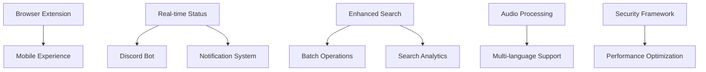

# Phase 2 Implementation Roadmap - Second Brain Project

## Executive Summary

Phase 2 focuses on enhanced integrations, mobile optimization, advanced AI capabilities, and performance improvements. This roadmap provides strategic direction for transitioning from core MVP functionality to enterprise-ready features while maintaining system stability and user experience quality.

**Phase Status**: Active Development  
**Timeline**: 8-12 weeks (September 2025 - November 2025)  
**Priority**: High-impact integrations and mobile experience  

---

## 1. Feature Breakdown & Prioritization

### 1.1 Priority Tier 1 - Critical Features (Weeks 1-4)

#### P1.1 Browser Extension Production Deployment
**Status**: 🔄 In Progress  
**Complexity**: Medium  
**Dependencies**: None  
**Resource Allocation**: 1 developer, 16 hours  

**Implementation Tasks**:
- [ ] Finalize manifest.json configuration for production
- [ ] Implement cross-browser compatibility testing
- [ ] Add error handling and offline capability
- [ ] Create extension store submission packages
- [ ] Deploy to Chrome Web Store and Firefox Add-ons

**Success Metrics**:
- Extension available in 2+ browser stores
- <100ms capture response time
- >95% capture success rate

#### P1.2 Enhanced Mobile Experience
**Status**: 📋 Planned  
**Complexity**: High  
**Dependencies**: Browser extension completion  
**Resource Allocation**: 1 developer, 24 hours  

**Implementation Tasks**:
- [ ] Responsive design optimization for mobile screens
- [ ] Touch-friendly interface improvements
- [ ] Progressive Web App (PWA) capabilities
- [ ] Mobile-specific shortcuts and gestures
- [ ] Offline capture and sync functionality

**Success Metrics**:
- Mobile usability score >90%
- Touch target size compliance
- PWA installation capability

#### P1.3 Discord Bot Feature Enhancements
**Status**: 🔄 In Progress  
**Complexity**: Medium  
**Dependencies**: Real-time status system  
**Resource Allocation**: 1 developer, 20 hours  

**Implementation Tasks**:
- [ ] Advanced command system with slash commands
- [ ] Multi-server configuration management
- [ ] Message thread capture and context preservation
- [ ] Role-based access control for bot functions
- [ ] Integration with team channels for collaborative notes

**Success Metrics**:
- Support for 10+ Discord servers
- <500ms command response time
- Team collaboration features active

#### P1.4 Batch Operations Interface
**Status**: 📋 Planned  
**Complexity**: Medium  
**Dependencies**: Enhanced search system  
**Resource Allocation**: 1 developer, 16 hours  

**Implementation Tasks**:
- [ ] Multi-select interface for notes
- [ ] Bulk tagging and metadata editing
- [ ] Batch export functionality
- [ ] Archive and deletion operations
- [ ] Undo/redo system for batch operations

**Success Metrics**:
- Handle 100+ notes in single operation
- Operations complete <5 seconds
- Zero data loss during batch operations

### 1.2 Priority Tier 2 - Enhancement Features (Weeks 5-8)

#### P2.1 Advanced Search Analytics
**Status**: 📋 Planned  
**Complexity**: Medium  
**Dependencies**: Existing search system  
**Resource Allocation**: 1 developer, 20 hours  

**Implementation Tasks**:
- [ ] Search query analytics and optimization
- [ ] User behavior tracking and insights
- [ ] Search result relevance feedback system
- [ ] Performance metrics dashboard
- [ ] Query suggestion and autocomplete

**Success Metrics**:
- Search relevance score >85%
- Analytics dashboard operational
- Query performance insights available

#### P2.2 Enhanced Audio Processing
**Status**: 📋 Planned  
**Complexity**: High  
**Dependencies**: Whisper.cpp optimization  
**Resource Allocation**: 1 developer, 24 hours  

**Implementation Tasks**:
- [ ] Multi-language transcription support
- [ ] Speaker identification and diarization
- [ ] Audio quality enhancement preprocessing
- [ ] Timestamp and bookmark integration
- [ ] Audio search within transcriptions

**Success Metrics**:
- Support 5+ languages
- >92% transcription accuracy
- Speaker identification >80% accuracy

#### P2.3 Advanced Notification System
**Status**: 📋 Planned  
**Complexity**: Medium  
**Dependencies**: Real-time status system  
**Resource Allocation**: 1 developer, 16 hours  

**Implementation Tasks**:
- [ ] Processing completion notifications
- [ ] Daily/weekly digest emails
- [ ] Action item reminder system
- [ ] Custom notification preferences
- [ ] Integration with external notification services

**Success Metrics**:
- Email delivery rate >95%
- User engagement with notifications >40%
- Customization options functional

### 1.3 Priority Tier 3 - Foundation Features (Weeks 9-12)

#### P3.1 Performance Optimization Suite
**Status**: 📋 Planned  
**Complexity**: High  
**Dependencies**: All core systems  
**Resource Allocation**: 1 developer, 32 hours  

**Implementation Tasks**:
- [ ] Database query optimization and indexing
- [ ] Caching layer implementation (Redis/Memory)
- [ ] Background processing queue optimization
- [ ] Frontend bundle size reduction
- [ ] CDN integration for static assets

**Success Metrics**:
- Page load time <1.5s (vs current 2s)
- Search response <50ms (vs current 100ms)
- Memory usage reduction >25%

#### P3.2 Security & Compliance Framework
**Status**: 📋 Planned  
**Complexity**: High  
**Dependencies**: Authentication system  
**Resource Allocation**: 1 developer, 28 hours  

**Implementation Tasks**:
- [ ] Enhanced JWT security and refresh tokens
- [ ] Rate limiting and DDoS protection
- [ ] Data encryption at rest and in transit
- [ ] Privacy compliance (GDPR/CCPA) features
- [ ] Security audit logging and monitoring

**Success Metrics**:
- Security audit compliance >95%
- Zero data breaches
- Privacy compliance certification

---

## 2. Dependencies & Critical Path Analysis

### 2.1 Critical Path Dependencies

### 2.2 Resource Dependencies

**Technical Dependencies**:
- Ollama service availability and model updates
- Whisper.cpp stability and performance
- SQLite scalability limits (monitor for PostgreSQL migration need)
- Browser extension store approval processes

**External Dependencies**:
- Discord API rate limits and policy changes
- Browser vendor extension policies
- Third-party integration service availability

---

## 3. Resource Allocation Strategy

### 3.1 Team Composition Recommendations

**Core Development Team**:
- **Senior Full-Stack Developer**: Phase 2 lead, architecture decisions
- **Frontend Specialist**: Mobile experience, browser extension
- **Backend/AI Developer**: Audio processing, search optimization
- **DevOps Engineer**: Performance, security, deployment

### 3.2 Agent Coordination Strategy

**Project Planner Agent**: 
- Weekly progress reviews and roadmap adjustments
- Dependency management and risk assessment
- Resource allocation optimization

**Code Writer Agent**:
- Feature implementation and debugging
- Code review and quality assurance
- Integration testing coordination

**Specialized Agents**:
- Mobile optimization agent for responsive design
- Security audit agent for compliance verification
- Performance testing agent for benchmarking

---

## 4. Risk Assessment & Mitigation

### 4.1 High-Risk Areas

#### R1. Browser Extension Store Approval
**Risk Level**: High  
**Impact**: Delays in user acquisition  
**Mitigation**:
- Submit early versions for review
- Maintain alternative distribution methods
- Prepare documentation and compliance materials

#### R2. Mobile Performance on Low-End Devices
**Risk Level**: Medium  
**Impact**: User experience degradation  
**Mitigation**:
- Progressive loading strategies
- Feature detection and graceful degradation
- Comprehensive device testing matrix

#### R3. Database Scalability Limits
**Risk Level**: Medium  
**Impact**: System performance at scale  
**Mitigation**:
- Implement database sharding strategies
- Prepare PostgreSQL migration path
- Monitor performance thresholds continuously

### 4.2 Technical Debt Management

**Priority Areas**:
1. Legacy code refactoring in core processing pipeline
2. Test coverage improvement (target >85%)
3. Documentation updates for new features
4. API versioning strategy implementation

---

## 5. Quality Assurance Framework

### 5.1 Testing Strategy

**Automated Testing**:
- Unit tests for all new features (95% coverage target)
- Integration tests for external service connections
- Performance regression testing
- Security vulnerability scanning

**Manual Testing**:
- Cross-browser compatibility testing
- Mobile device testing matrix
- User acceptance testing for UI/UX changes
- Load testing for batch operations

### 5.2 Deployment Strategy

**Staging Environment**:
- Feature branches tested in isolation
- Integration testing in staging environment
- User acceptance testing with stakeholders
- Performance validation against production data

**Production Deployment**:
- Blue-green deployment strategy
- Feature flags for gradual rollout
- Automated rollback procedures
- Real-time monitoring and alerting

---

## 6. Success Metrics & KPIs

### 6.1 Technical Metrics

**Performance KPIs**:
- Page load time: <1.5s (current: 2s)
- Search response: <50ms (current: 100ms)
- Audio transcription accuracy: >92% (current: 90%)
- System uptime: >99.5%

**User Experience KPIs**:
- Mobile usability score: >90%
- Browser extension adoption: >1000 users
- Feature utilization rate: >60%
- User retention (monthly): >80%

### 6.2 Business Metrics

**Adoption Metrics**:
- New user acquisition: +50% per month
- Active integrations per user: >2
- Content creation rate: +25% per user
- Support ticket volume: <5% increase

---

## 7. Phase 3 Preparation

### 7.1 Phase 3 Prerequisites

**Technical Foundation**:
- Scalable architecture patterns established
- Security framework operational
- Performance baselines documented
- API versioning implemented

**Feature Prerequisites**:
- Advanced AI capabilities framework
- Multi-user support architecture
- Real-time collaboration infrastructure
- Analytics and insights platform

### 7.2 Technology Evolution Planning

**AI/ML Advancement**:
- Vector database integration planning
- Advanced model fine-tuning capabilities
- Semantic search accuracy improvements
- Natural language query processing

**Infrastructure Scaling**:
- Cloud deployment strategies
- Microservices architecture consideration
- Container orchestration planning
- Database federation strategies

---

## 8. Communication & Reporting

### 8.1 Progress Reporting Schedule

**Weekly Reports**:
- Feature completion status
- Risk assessment updates
- Resource utilization metrics
- Blocker identification and resolution

**Milestone Reviews**:
- End of Priority Tier reviews
- Stakeholder demonstration sessions
- User feedback incorporation
- Phase 3 planning sessions

### 8.2 Stakeholder Engagement

**Internal Stakeholders**:
- Development team coordination meetings
- Architecture review sessions
- Quality assurance checkpoints
- Performance review meetings

**External Stakeholders**:
- User feedback collection and analysis
- Beta user engagement programs
- Community feedback integration
- Market research and competitive analysis

---

## Conclusion

Phase 2 represents a critical transition from MVP to enterprise-ready platform. Success requires careful attention to user experience, performance optimization, and scalable architecture patterns. The roadmap provides flexibility for adaptation while maintaining focus on high-impact deliverables.

**Next Steps**:
1. Validate resource allocation with team capacity
2. Establish development environment and CI/CD pipeline
3. Begin Priority Tier 1 implementation
4. Schedule weekly progress reviews

---

**Document Version**: 1.0  
**Last Updated**: August 28, 2025  
**Next Review**: September 4, 2025  
**Owner**: Project Planning Team