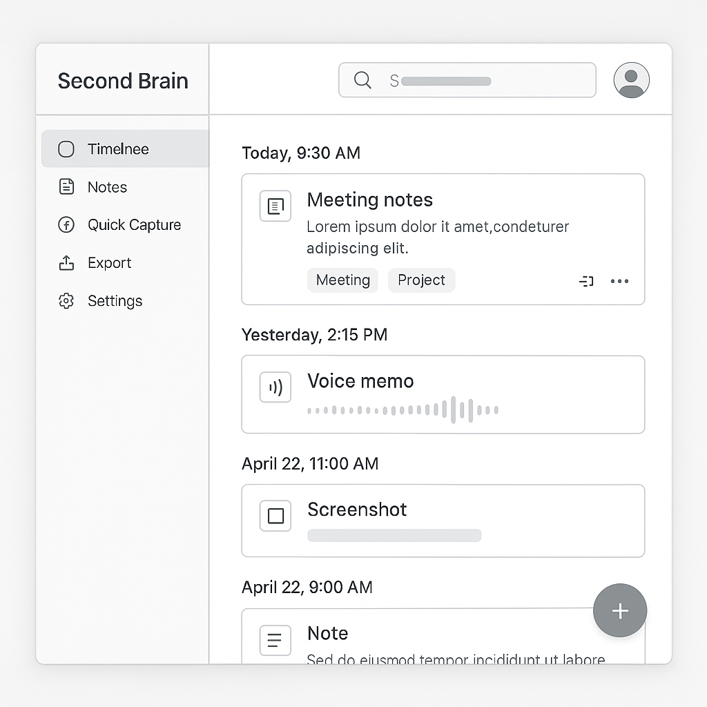
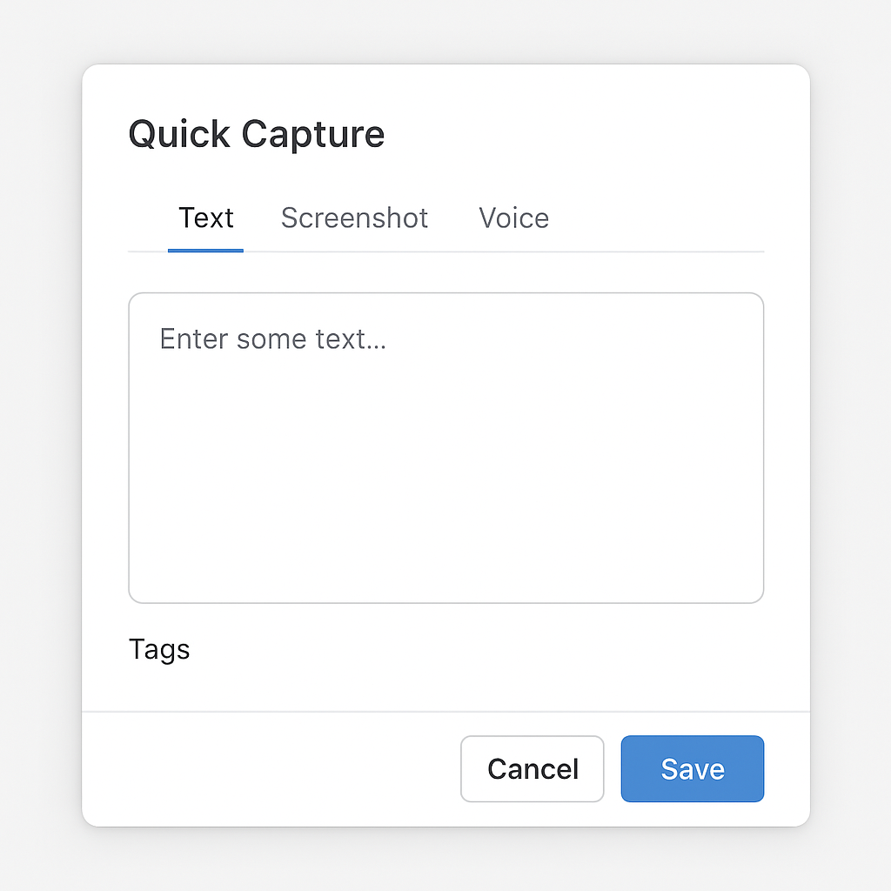

<p align="center">
  
  <h1 align="center">Second Brain</h1>
  <p align="center">Your AI-powered note-taking companion, tightly integrated with <b>Obsidian</b>, <b>Apple Shortcuts</b>, and the power of modern LLMs.</p>
</p>

---

## ✨ Features

- **📝 Quick Capture**: Instantly jot down notes or upload audio—right from your browser or iPhone Home Screen.
- **🎙️ Audio to Text**: Upload or record audio, transcribe with Whisper.cpp, and summarize with AI.
- **📲 Apple Shortcuts Integration**: Add notes from any Apple device with a tap or widget!
- **🔎 Powerful Search**: Find notes by text or tag, with highlights.
- **🏷️ Smart Tags**: Tag notes for easy filtering; let AI suggest tags!
- **🧠 AI Summaries & Titles**: Each note and transcript is summarized and titled using LLMs (Ollama).
- **🎧 Inline Audio Playback**: Play audio files directly in your web UI or export to Obsidian.
- **🔗 Obsidian Export**: Seamlessly sync notes (including audio links!) into your Obsidian vault.
- **🦄 Beautiful Timeline UI**: Grouped by day, cleanly themed, and fully responsive.
- **🔌 Webhook API**: Integrate with external tools and automations.

---

## 📸 Screenshots

<p align="center">
  
  <br>
  <em>Timeline view — capture, search, and manage your Second Brain.</em>
</p>

<p align="center">
  
  <br>
  <em>Quickly add notes or audio from any device.</em>
</p>

---

## 🚀 Quickstart

**Requirements:**  
- Python 3.10+  
- `ffmpeg` installed (`brew install ffmpeg` on Mac)  
- [Whisper.cpp](https://github.com/ggerganov/whisper.cpp) binary + English model  
- [Ollama](https://ollama.com/) running locally for LLM summarization/title/tagging

### 1. Clone & Install

```bash
git clone https://github.com/dhouchin1/second_brain.git
cd second_brain
python3 -m venv venv
source venv/bin/activate
pip install -r requirements.txt


2. Configure
Download or build Whisper.cpp
(see repo for details, or use make on Mac/Linux).

Download the model:
Place ggml-base.en.bin in whisper.cpp/models/ inside your project folder.

bash
Copy
Edit
# Example: Build whisper.cpp and download the model
git clone https://github.com/ggerganov/whisper.cpp.git
cd whisper.cpp
make
mkdir -p models
cd models
wget https://huggingface.co/ggerganov/whisper.cpp/resolve/main/ggml-base.en.bin
cd ../..
Start Ollama (if not already running) and pull your preferred model:
(Llama 3 is recommended; adjust model name as needed.)

bash
Copy
Edit
ollama serve
ollama pull llama3
3. Run the Server
bash
Copy
Edit
uvicorn app:app --reload --host 0.0.0.0 --port 8084
Open http://localhost:8084/ in your browser.

📱 Apple Shortcuts Integration
You can send notes directly from iOS using the /webhook/apple endpoint.

POST to: http://YOUR_SERVER_IP:8084/webhook/apple

Body (JSON):

json
Copy
Edit
{
  "note": "Your text or dictation",
  "tags": "quick,idea",
  "type": "apple"
}
Use Apple Shortcuts “Get Contents of URL” to POST notes from your phone or an iOS Widget.

🗂️ Export to Obsidian
All notes and audio can be exported as Markdown and media files for use with Obsidian.

See the code in processor.py or ask for automation scripts!

✨ Screenshots


🛠️ Configuration
Configuration is managed via environment variables read by `config.py`.
The following variables are available (defaults shown):

- `DB_PATH` – path to the SQLite notes database (default: `<repo>/notes.db`)
- `VAULT_PATH` – path to your Obsidian vault (default: project root)
- `AUDIO_DIR` – directory for uploaded audio files (default: `<repo>/audio`)
- `WHISPER_CPP_PATH` – path to whisper.cpp binary (default: `<repo>/whisper.cpp/build/bin/whisper-cli`)
- `WHISPER_MODEL_PATH` – path to Whisper model file (default: `<repo>/whisper.cpp/models/ggml-base.en.bin`)
- `OLLAMA_API_URL` – Ollama API endpoint (default: `http://localhost:11434/api/generate`)
- `OLLAMA_MODEL` – Ollama model name (default: `llama3.2`)

Tweak the prompts in `llm_utils.py` for custom AI summarization/tagging

🤝 Contributing
PRs, issues, and feature requests welcome!

Roadmap:

 Mobile UI polish

 AI-powered title generation

 Better Markdown/Obsidian integration

 User accounts and cloud sync (optional)

License
MIT

Made with ❤️ by Dan Houchin and contributors.